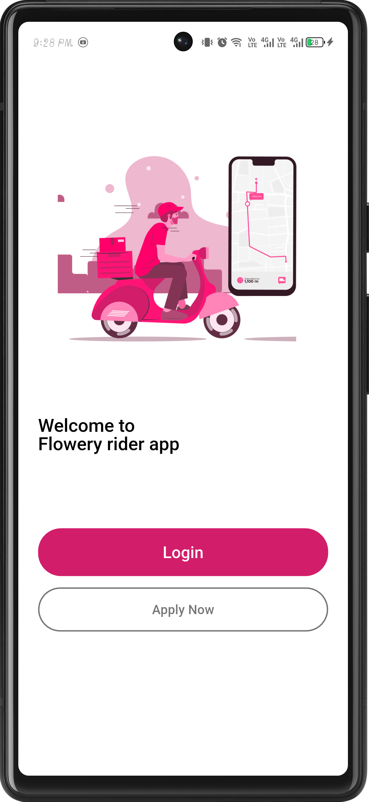
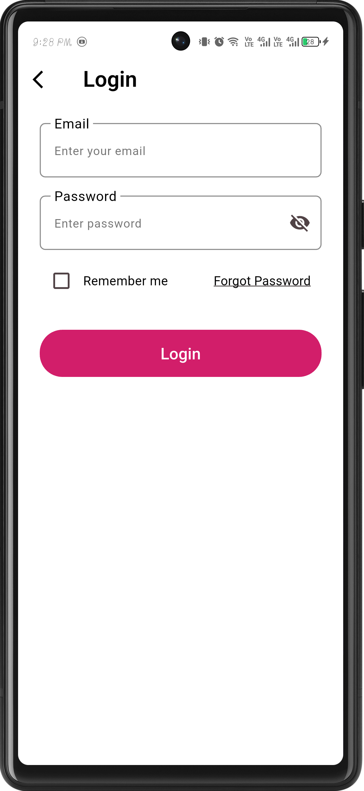
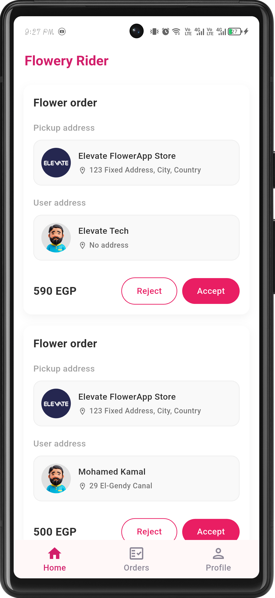
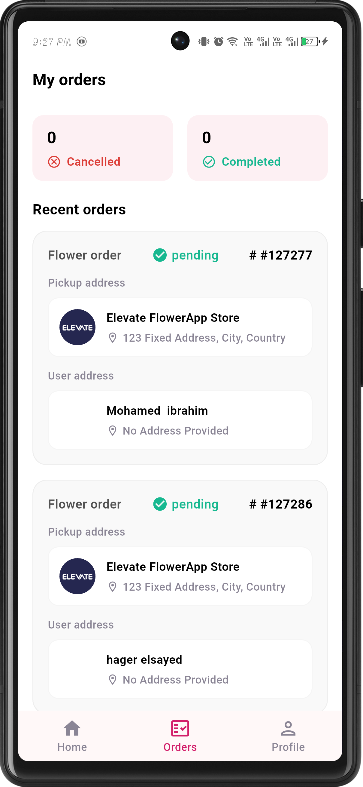
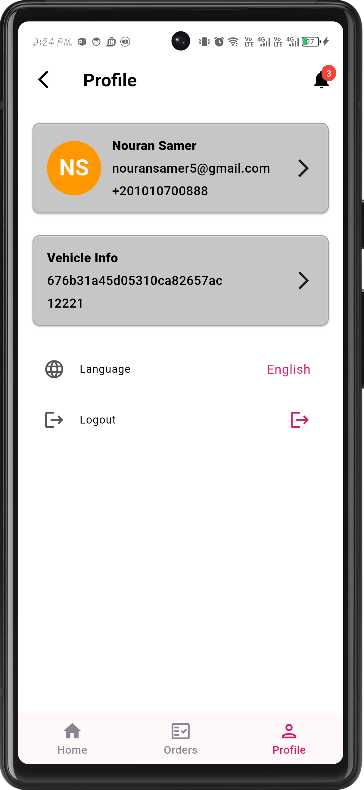
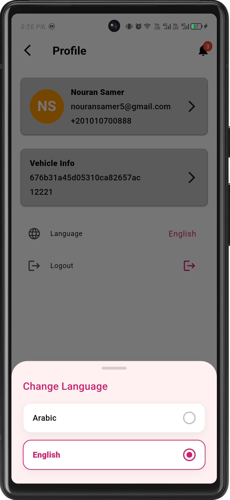

# 🚚 Flowery Rider - Flutter Driver Tracking Application

## 💻 Project Description

### 🎯 Overview
Flowery Rider is a modern Flutter mobile application designed for delivery drivers on the **Flowery** platform. It provides a seamless and intuitive experience for managing orders, tracking real-time locations, updating delivery statuses, and receiving instant push notifications.

The app follows **Clean Architecture** principles with a feature-based modular structure to ensure scalability, maintainability, and high performance.

---

## 🏗️ Architecture and Structure

The project follows a **Clean Architecture** approach to ensure clear separation of concerns and maintainable code structure.

| Layer | Folder(s) | Role & Responsibilities |
| :--- | :--- | :--- |
| **Presentation** | `presentation` (screens, widgets, cubits) | Handles UI rendering and user interaction using Bloc/Cubit for state management. |
| **Domain** | `domain` (entities, repos, usecases) | Contains business logic, entities, and repository contracts independent of data sources. |
| **Data** | `data` (models, datasource, repos) | Handles API calls, local storage, and data mapping between models and entities. |
| **Core / API** | `app/core/api_manger` | Centralized networking using Dio & Retrofit with interceptors and error handling. |

---

## ✨ Key Features

- **Authentication & Security**
  - Login and Registration flow
  - OTP and Reset Password verification
  - Secure session management with token storage

- **Onboarding**
  - First-launch walkthrough screens for new drivers

- **Order Management**
  - Driver order dashboard with real-time status updates
  - Full order detail view
  - Order history and listing

- **Location & Maps**
  - Google Maps integration with live driver location
  - Polyline route rendering for delivery navigation
  - GPS Geolocation support

- **Push Notifications**
  - Firebase Cloud Messaging (FCM) for real-time order alerts
  - Local notifications for foreground messages
  - Background message handling

- **Profile & Vehicle**
  - Driver profile management
  - Edit vehicle information
  - Change password

- **Localization**
  - Full **Arabic / English** support with RTL layout
  - `easy_localization` powered

- **State Management**
  - Bloc/Cubit architecture with reactive UI updates

- **Dependency Injection**
  - GetIt & Injectable for scalable dependency management

- **Crash Reporting**
  - Firebase Crashlytics integrated

---

## 🖼️ Screenshots

### 🔐 Authentication
<div style="display: flex; gap: 10px; flex-wrap: wrap;">
  
  
  
  
  
  
</div>

---

### 🏠 Home & Orders
<div style="display: flex; gap: 10px; flex-wrap: wrap;">
  
  
  
  
  
  
  
  
</div>

---

### 🚗 Apply as Driver
<div style="display: flex; gap: 10px;">
  
  
</div>

---

### 👤 Profile & Settings
<div style="display: flex; gap: 10px; flex-wrap: wrap;">
  
  
  
  
</div>

---

### 🌍 Localization
<div style="display: flex; gap: 10px;">
  
</div>

---

## 🛠️ Tech Stack & Dependencies

### Core
| Package | Purpose |
|---|---|
| `flutter_bloc` / `bloc` | State management (BLoC/Cubit pattern) |
| `go_router` | Declarative routing |
| `get_it` + `injectable` | Service locator & dependency injection |
| `dio` + `retrofit` | HTTP client & REST API code generation |
| `pretty_dio_logger` | Network request/response logging |
| `equatable` | Value equality for states & entities |

### Firebase
| Package | Purpose |
|---|---|
| `firebase_core` | Firebase initialization |
| `firebase_messaging` | Push notifications (FCM) |
| `firebase_crashlytics` | Crash reporting & monitoring |
| `cloud_firestore` | Real-time driver token storage |

### Maps & Location
| Package | Purpose |
|---|---|
| `google_maps_flutter` | Interactive map rendering |
| `geolocator` | Device GPS access |
| `flutter_polyline_points` | Route polyline drawing |
| `googleapis_auth` | Google APIs OAuth2 authentication |

### UI & UX
| Package | Purpose |
|---|---|
| `easy_localization` | i18n — English & Arabic with RTL |
| `flutter_local_notifications` | Local notification display |
| `cached_network_image` | Efficient remote image loading |
| `shimmer` / `skeletonizer` | Loading skeleton UI animations |
| `lottie` | Lottie animation playback |
| `flutter_svg` | SVG asset rendering |
| `image_picker` | Camera/gallery image selection |
| `url_launcher` | Open links, calls, and maps |

### Data & Storage
| Package | Purpose |
|---|---|
| `shared_preferences` | Token & settings local storage |
| `json_annotation` + `json_serializable` | JSON serialization code generation |

---

## 🚀 Getting Started

```bash
# Clone the repository
git clone https://github.com/alibesar7/tracking_app
cd tracking_app

# Install dependencies
flutter pub get

# Run code generation (Retrofit, Injectable, JSON)
dart run build_runner build --delete-conflicting-outputs

# Run the app
flutter run
```

## 🧪 Testing

| Type | Packages |
|---|---|
| Unit / Widget Tests | `flutter_test`, `bloc_test` |
| Mocking | `mockito`, `mocktail` |
| Network Image Mocking | `network_image_mock` |

```bash
flutter test
```

---

## 🌐 Localization

Supports **English** and **Arabic** with RTL layout.

```
assets/translations/
├── en.json
└── ar.json
```

---

## 🧭 App Routes

| Route | Path | Screen |
|---|---|---|
| App Start | `/appStart` | Splash / Decision screen |
| Onboarding | `/onboarding` | First-time walkthrough |
| Login | `/login` | Driver login |
| Register | `/signup` | Driver registration |
| Forgot Password | `/forget-password` | Password recovery |
| Verify Code | `/verify-reset-code` | OTP verification |
| Reset Password | `/reset-password` | Set new password |
| Home | `/home` | Orders dashboard |
| My Orders | `/myOrders` | Orders list |
| Order Details | `/orderDetails` | Single order view |
| Location | `/locationPage` | Map & tracking |
| Profile | `/profile` | Driver profile |
| Edit Profile | `/editDriverProfile` | Update profile |
| Edit Vehicle | `/editVehicle` | Update vehicle info |
| Change Password | `/changePassword` | Password update |
| Apply | `/applyScreen` | Driver application |


